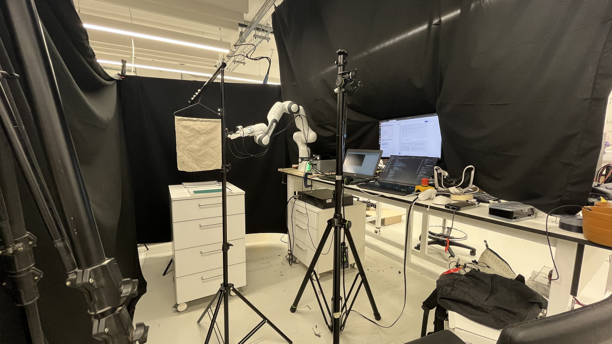
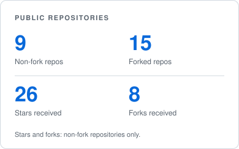
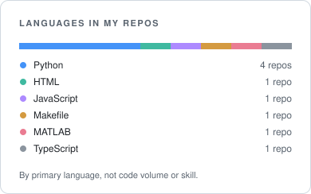

<h1 align="center">Suhang Xia · 夏苏杭</h1>

<b>Robot Learning &nbsp; / &nbsp; Tactile Perception &nbsp; / &nbsp; Surgical Robotics</b>

  <a href="https://suhangxia.github.io">Website</a> &nbsp;·&nbsp;
  <a href="mailto:suhang.xia@kcl.ac.uk">Email</a> &nbsp;·&nbsp;
  <a href="https://github.com/SuhangXia?tab=repositories">Repositories</a>

<em>Learning to perceive, touch, and act in the physical world.</em>

I am an MSc Robotics student at **King’s College London**, supervised by **Dr Shan Luo**. I work on vision–tactile–language–action models and robotic manipulation. Previously, I developed calibration and navigation algorithms for surgical robots at **Hangzhou Lancet Robotics**.

  

*My cloth-manipulation research workcell: Franka, cameras, fabric fixture, and acquisition system.*

## Research

### Tactile UMI · Learning from touch

Turning handheld demonstrations into robot-ready trajectories through calibrated motion, wrist RGB, and fingertip touch. **Visuotactile learning · Diffusion Policy · Franka.**

### TouchUntilCertain · Knowing when to sense again

Reliability-guided tactile sensing for fabric thickness and areal-mass estimation, built on Fabric-Omni. **Active perception · Uncertainty · Cloth manipulation.**

### Surgical robotics · From images to instruments

Connecting image guidance with robot motion through coordinate transforms, robot and tool calibration, navigation, and system metrology. **Calibration · Image guidance · Control.**

### RoboCup UR5e · Perception to execution

Team lead and system architect for autonomous object sorting, integrating perception, grasp planning, execution, and recovery. **ROS · MoveIt · GraspNet.** [Code ↗](https://github.com/SuhangXia/robocup_ur5e)

**More open-source work** &nbsp; [DeCo-MAE](https://github.com/SuhangXia/DeCo-MAE) — compositional action understanding &nbsp;·&nbsp; [Indoor UAV navigation](https://github.com/SuhangXia/IndoorUAV-NaviAlgoSim) &nbsp;·&nbsp; [Quadrotor control](https://github.com/SuhangXia/quadrotor-pd-control)

## Open source, in numbers

  <picture>
    <source media="(prefers-color-scheme: dark)" srcset="./assets/stats/overview-dark.svg" />
    
  </picture>
  <picture>
    <source media="(prefers-color-scheme: dark)" srcset="./assets/stats/languages-dark.svg" />
    
  </picture>

<!-- STATS:START -->

Statistics &amp; methodology · updated 2026-09-22 UTC

24 public repositories: **9 non-fork** and **15 forked**. Non-fork repositories have received **26 stars** and **8 forks**.

Primary languages: Python (4) · Astro (1) · HTML (1) · JavaScript (1) · Makefile (1) · MATLAB (1). Each non-fork repository counts once, including archived repositories. Repositories without a detected language are shown separately. Language counts describe repository composition, not proficiency or authorship.

Source: [GitHub REST API](https://api.github.com/users/SuhangXia/repos?type=owner). Public repositories only. [Refresh workflow](https://github.com/SuhangXia/suhangxia/actions/workflows/profile-stats.yml).

<!-- STATS:END -->

## Tools I work with

**Code** &nbsp; Python · C++ · MATLAB 
**Robotics** &nbsp; ROS · MoveIt · Gazebo · PX4 
**Learning & sensing** &nbsp; Diffusion Policy · VideoMAE · GelSight · force sensing

---

  Interested in tactile intelligence, robot learning, or surgical systems? 
  <a href="mailto:suhang.xia@kcl.ac.uk">Let’s connect.</a> &nbsp; London, UK

