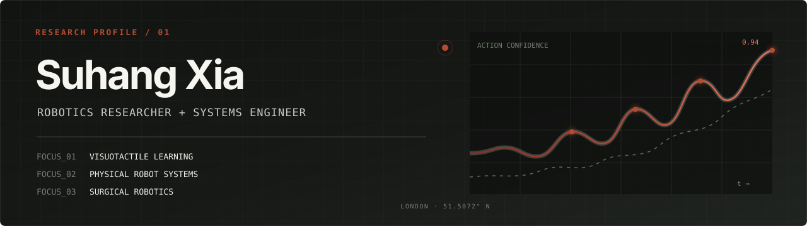
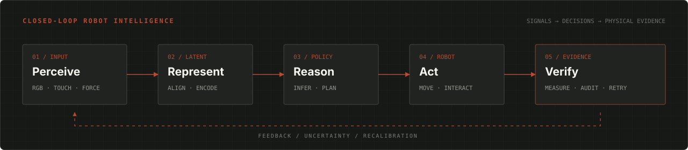

<div align="center">
  
</div>

<p align="center">
  <a href="https://suhangxia.github.io"></a>
  <a href="https://scholar.google.com/citations?user=qc6CJjYAAAAJ"></a>
  <a href="mailto:suhang.xia@kcl.ac.uk"></a>
</p>

I build robotic systems that turn **multimodal perception into precise physical action**. My work sits between robot learning, visuotactile sensing, and image-guided surgical robotics—with a practical bias toward systems that remain inspectable outside the model.

Currently an **MSc Robotics researcher at King’s College London**, supervised by Dr Shan Luo. Previously an Algorithm Engineer at Hangzhou Lancet Robotics.

```python
research = {
    "question": "How can robots perceive uncertainty and act precisely?",
    "signals":  ["vision", "touch", "language", "force"],
    "systems":  ["deformable manipulation", "surgical robotics"],
    "principle": "make every transformation inspectable",
}
```

## Research loop

<div align="center">
  
</div>

## Selected systems

| System | Research question | My work | Links |
|:--|:--|:--|:--|
| **Tactile UMI** | How can handheld visuotactile demonstrations become robot-ready trajectories? | Calibrated multimodal acquisition, auditable preprocessing, UniForce-conditioned Diffusion Policy, Franka FR3 deployment | [Portfolio](https://suhangxia.github.io) |
| **VTLA for Cloth Sorting** | When is a second touch worth its sensing cost? | Fabric-Omni dataset; reliability-guided active tactile perception for thickness and areal-mass estimation | [Portfolio](https://suhangxia.github.io) |
| **Percutaneous Puncture Robot** | How does an image-space plan become a constrained physical trajectory? | Project leadership; robot, fixture and TCP calibration; Leica metrology; animal-study design | [Portfolio](https://suhangxia.github.io) |
| **RoboCup UR5e** | How can a modular system perceive, grasp, sort, and recover under time constraints? | Team lead and system architect; ROS orchestration across YOLOv8, GraspNet, MoveIt and execution | [Code](https://github.com/SuhangXia/robocup_ur5e) |
| **DeCo-MAE** | Can robot-observed actions be represented as composable semantics? | Decomposed action/tool/modifier supervision for unseen-action recognition | [Code](https://github.com/SuhangXia/DeCo-MAE) · [Report](https://github.com/SuhangXia/DeCo-MAE/blob/main/DeCo-MAE_Report_v09.pdf) |
| **Indoor UAV Navigation** | How can a quadrotor plan smooth collision-free motion indoors? | ROS, PX4, Gazebo and EGO-Planner simulation platform; controller and trajectory analysis | [Portfolio](https://suhangxia.github.io) |

## Working stack

<p>
  
  
  
  
  
  
  
  
</p>

```text
PERCEPTION    RGB · GelSight · force · medical imaging
LEARNING      multimodal representation · imitation learning · uncertainty
ROBOTICS      calibration · coordinate transforms · planning · control
VALIDATION    dataset audit · metrology · simulation · physical experiments
```

## Engineering principles

- **Evidence before claims** — keep data lineage, calibration, and evaluation visible.
- **Systems over demos** — connect sensing, models, control, and failure recovery end to end.
- **Uncertainty is actionable** — use confidence to decide when to sense again or stop.
- **Research should be reproducible** — prefer explicit interfaces, inspectable artifacts, and documented assumptions.

<div align="center">
  <sub>London, United Kingdom · <a href="mailto:suhang.xia@kcl.ac.uk">suhang.xia@kcl.ac.uk</a></sub>
</div>
